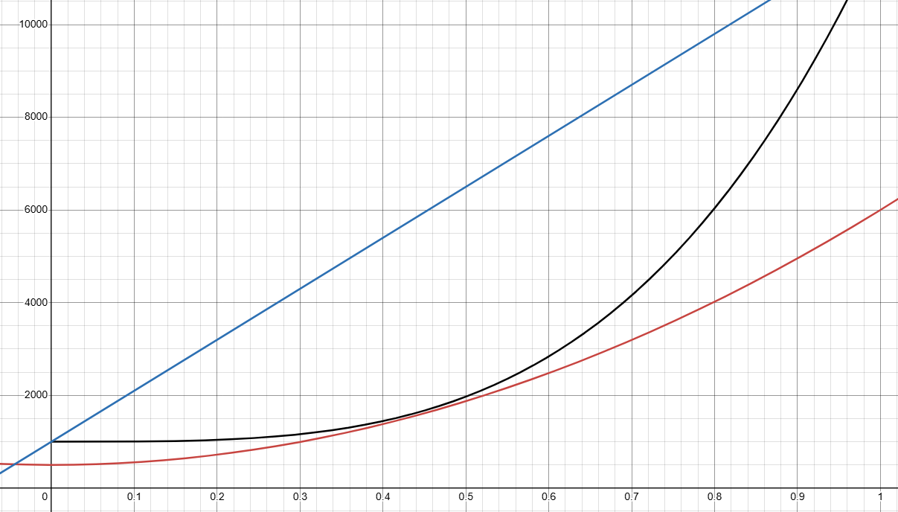
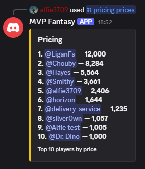
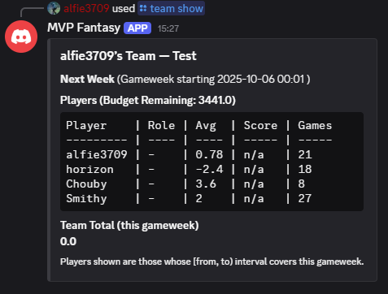

# MVP Fantasy

## Fantasy CS2 League within discords

MVP Fantasy is a discord based bot that allows the creation of fantasy leagues within a discord server, similiar in nature to [Fantasy Premier League](https://fantasy.premierleague.com/).

## What the project is

## How it works
- Users register their CS2 profile, which links their SteamID and automatically pulls matches via Leetify
- Each players stats, ratings, and game history are stored and updated automatically
- Fantasy points are calculated using average weighted performance metrics (more info below)
- Teams have budgets and roster limits, enforcing balanced selections
- Build phase which allows unlimited transfers to help users get started

## Features

- Combines real in-game stats with fantasy league mechanics
- Offers automated tracking so no manual data entry is required
- Allows the historical tracking of teams to view prior stats
- Includes dynamic player pricing based on long term stats: Premier, Renown, Faceit Elo & Long term average leetify ratings
- Designed to support multi-servers with independent leaderboards
- Modular command design, allowing easy improvements and modifications
- Data is persisted with a SQLite databases

## User Guide

- Register using `/account register <steamid>`
- Check players pricing using `/pricing show`
- Create a team using `/team create <name>`
- Add players using `/team add <@user>`
- Remove players from team using `/team remove <@user>`
- Check leaderboard with `/leaderboard show`

- Transfers made apply for the start of the next gameweek (Monday 00:00 UK time)
- Admins can trigger manual recomputations or data refreshes when needed

## Scoring System

- Stats are collected from all the players games within the ranking week. 
- They are then divided by the amount of games(to balance those who play more)
- Then multiplied by the following modifiers 

| Platform    | Modifier |
|-------------|----------|
| Faceit      | 1.2      |
| Renown      | 1.1      |
| Premier     | 1        |
| Competitive | 0.8      |

| Stat           | Modifier |
|----------------|----------|
| Leetify Rating | 10       |
| ADR            | 0.1      |
| Trade Kills    | 2        |
| Flashes        | 1        |
| Util DMG       | 0.05     |
| Entries[^1]    | 3        |

- Win-rate smoothing is also applied using Bayesian shrinkage
  - This prevents a player who's 2-0 from having an inflated 100% winrate
- Win-rate multiplier
  - This starts at 1x if win-rate is 50% and increases for every % above 50.
  - Does not penalise users for negative (< 50%) winrates

### Example Calculations

| Player | LR   | ADR | Trades | Entries | Flashes | UtilDMG | Platform | Winrate | Games |
|--------|------|-----|--------|---------|---------|---------|----------|---------|-------|
| 1      | 1.1  | 80  | 5      | 2       | 3       | 150     | Premier  | 55%     | 18    |
| 2      | 1.2  | 90  | 6      | 4       | 2       | 200     | Faceit   | 65%     | 20    |
| 3      | 1.15 | 85  | 4      | 1       | 1       | 100     | Renown   | 100%    | 2     |

In this scenario we have 3 players:
- Player 1 is your average Premier player 

1. Base Average:  
`(1.10×10) + (80×0.1) + (5×2) + (2×3) + (3×1) + (150×0.05)`  
`= 11 + 8 + 10 + 6 + 3 + 7.5 = 45.5 points`  

2. Platform Multiplier [^2]  
`45.5 x 1`

3. Win-rate Multiplier(10W | 18G)  
`wr_eff = (10 + 10 x 0.5)/(18 + 10) = 0.571`  
`wr_mult = 1.0 + (0.571 - 0.5) x 0.6 = 1.0426`  

4. Final Weekly Score:  
`45.5 x 1.04 = **47.4**`  

- Player 2 is a decent Faceit player 

1. Base Average:  
`(1.2×10) + (90×0.1) + (6×2) + (4×3) + (2×1) + (200×0.05)`  
`= 12 + 9 + 12 + 12 + 2 + 10 = 57 points`  

2. Platform Multiplier [^2]  
`57 × 1.2 = 68.4`  

3. Win-rate Multiplier(10W | 18G)  
`wr_eff = (13 + 10 × 0.5) / (20 + 10) = 0.6`   
`wr_mult = 1 + (0.6 − 0.5) × 0.6 = 1.06`  

4. Final Weekly Score:  
`68.4 x 1.06 = **72.5**`  

- Player 3 is a renown player who doesn't play often  

1. Base Average:  
`(1.15×10) + (85×0.1) + (4×2) + (1×3) + (1×1) + (100×0.05)`  
`= 11.5 + 8.5 + 8 + 3 + 1 + 5 = 37`  

2. Platform Multiplier [^2]  
`37 x 1.1 = 40.7`  

3. Win-rate Multiplier(10W | 18G)  
`wr_eff = (2 + 10 × 0.5) / (2 + 10) = 0.583`  
`wr_mult = 1 + (0.583 − 0.5) × 0.6 = 1.05`  

4. Final Weekly Score:  
`40.7 * 1.05 **42.7**`  

[^1]: Currently not supported by Leetify API, Coming Soon
[^2]: Platform multiplier is calculated on a game-by-game basis not once

## Pricing System

- Pricing is calculated using the following 4 inputs:
1. Faceit Elo
2. Premier Elo
3. Renown Elo
4. Last 100 game average leetify rating

Each of these metrics are normalised with the following ranges
1. Faceit: 3800 <-> 400
2. Premier 33000 <-> 1000
3. Renown 25000 <-> 3000
4. Leetify -5 <-> 5

These contribute differently via weights so the skill calculation is as follows:

`skill = (0.5 x leetify_norm) + (0.25 x faceit_norm) + (0.2 x premier_norm) + (0.05 x renown_norm)`

This skill score is then converted to percentiles (across the global userbase) with the lowest being 0.00 and highest 1.00

The final price is calculated as follows:  
`price = P_MIN + (P_MAX − P_MIN) * (percentile ** GAMMA)`  

Where: Minimum = 1000, Maximum = 12000, Gamma = 3.5. Gamma affects the slope of the pricing function. For example a Gamma of 
1.0 would make the price curve linear, 2.0 would be mildly exponential and 3.5 is exponential.

The chart below shows how these lines look in practice with the Y-axis representing price and the X axis representing the players percentile
The lines show:
-  Blue = Gamma = 1.
- Red = Gamma = 2.
- Black = Gamma = 3.5

### Example Calculations

| Player | LR   | Faceit | Premier | Renown |
|--------|------|--------|---------|--------|
| 1      | 1.1  | 2,000  | 15,000  | 12,000 |
| 2      | 1.35 | 3,200  | 28,000  | 22,000 |
| 3      | 0.95 | 1000   | 6000    | 5000   |

Again, in this scenario we have 3 players.

- Player 1 is a decently strong player, not the best, not the worst.
1. Calculate normalised values:  
    `leetify_norm = (1.10 − (−5)) / 10 = 0.610`  
    `faceit_norm = (2000 − 400) / 3400 = 0.471`  
    `premier_norm = (15000 − 1000) / 32000 = 0.438`  
    `renown_norm = (12000 − 3000) / 22000 = 0.409` 
2. Calculate Skill score:  
   `skill = 0.50 x 0.610 + 0.25 x 0.471 + 0.20 x 0.438 + 0.05 x 0.409 ` 
    `= 0.531`
3. Calculate percentile (illustration)
   If percentile = 0.55 then:  
   `price = 1000 + 11000 x (0.55^3.5)`  
    `= 2,357`

- Player 2 is a very strong player in the top 0.01% of players.
1. Calculate normalised values:  
    `leetify_norm = (1.35 − (−5)) / 10 = 0.635`  
    `faceit_norm = (3200 − 400) / 3400 = 0.824`  
    `premier_norm = (28000 − 1000) / 32000 = 0.844`  
    `renown_norm = (22000 − 3000) / 22000 = 0.864` 
2. Calculate Skill score:  
   `skill =  (0.50 x 0.635) + (0.25 x 0.824) + (0.20 x 0.844) + (0.05 x 0.864) ` 
    `= 0.531`
3. Calculate percentile (illustration)
   If percentile = 0.9 then:  
   `price = 1000 + 11000 x (0.90^3.5) 8,607`  
    `= 8,607`

- Player 3 is a new player just below or around the average.
1. Calculate normalised values:  
    `leetify_norm = (0.95 − (−5))/10 = 0.595`  
    `faceit_norm = (1000 − 400)/3400 = 0.176`  
    `premier_norm = (6000 − 1000)/32000 = 0.156`  
    `renown_norm = (5000 − 3000)/22000 = 0.091`  
2. Calculate Skill score:  
   `skill =  (0.50 x 0.595) + (0.25 x 0.176) + (0.20 x 0.156) + (0.05 x 0.091) ` 
    `= 0.377 `
3. Calculate percentile (illustration)
   If percentile = 0.2 then:  
   `price = 1000 + 11000 x (0.20^3.5) ≈ 1,039`  
    `= 1,039`

Prices and percentiles are recomputed each pricing update, allowing players to make a profit (or loss) when purchasing and selling players.
Weights and Gamma will be tuned throughout the testing and use of the bot to make it better.

# Example Images

Below shows the `/pricing prices` command and lists player prices in order of most expensive to cheapest

Below shows the `/team show` command with information about this weeks games. The role column is coming soon and will feature multipliers for different stats.

*N.B: Quite a few files are hidden in this Github Repo* 